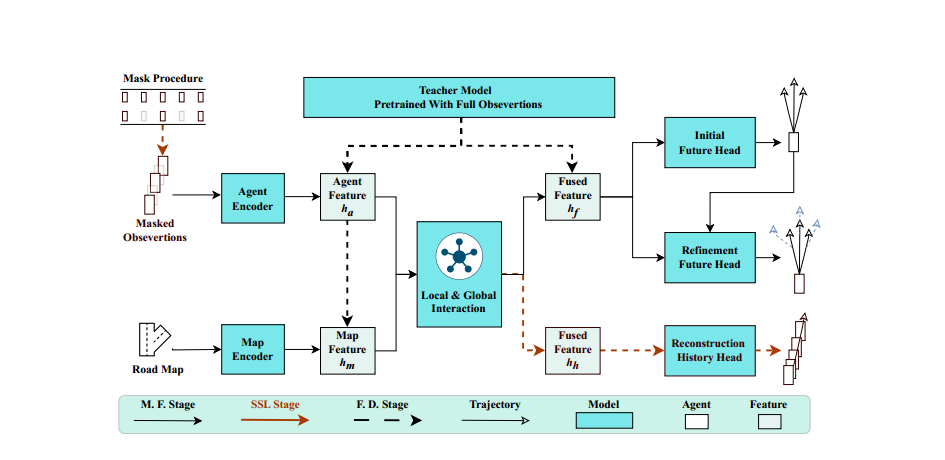
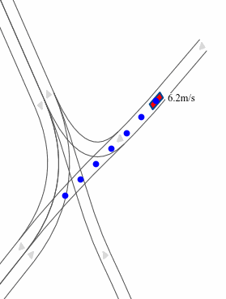

# POP-CODE

**This is the repo for ''Improving Autonomous Driving Safety with POP: A Framework for Accurate Partially Observed Trajectory Predictions ''.**

**News: Our work is accepted in** [ICRA2024](https://2024.ieee-icra.org/) !!! [Paper](https://arxiv.org/abs/2309.15685) | [Project Page](https://chantsss.github.io/POP/)





# Content
- [Setup](#setup-environment)
- [Preprocess](#preprocess)
- [Train & Eval](#train--eval)
- [Closed loop simulation](#closed-loop-simulation-on-commonroad-interaction-dataset)
- [Acknowledgements](#acknowledgements)
- [Citation](#if-you-find-this-repo-is-useful-please-consider-giving-us-a-star-or-citation)

## Setup environment

- Create conda environment
    ```
    conda create -n POP python=3.8
    conda activate POP
    ```
    **You can choose to Install environment from requirement file or install step by step**
    - 1. Install environment from requirements.txt
        ```
        conda install --yes --file requirements.txt
        ```
        
    - 2. Install step by step 
        - Install torch (torch>=1.11.0 is required), choose the version according to your device
            ```
            # Local
            pip install torch==1.11.0+cu113 torchvision==0.12.0+cu113 --extra-index-url https://download.pytorch.org/whl/cu113
            pip install natten==0.14.2 -f https://shi-labs.com/natten/wheels/cu113/torch1.11/index.html

            # Server
            pip install torch==1.13.0+cu117 torchvision==0.14.0+cu117 torchaudio==0.13.0 --extra-index-url https://download.pytorch.org/whl/cu117 -i https://pypi.mirrors.ustc.edu.cn/simple/
            pip install natten==0.14.6+torch1130cu117 -f https://shi-labs.com/natten/wheels/cu117/torch1.13/index.html

            Note: '-i https://pypi.mirrors.ustc.edu.cn/simple/' is used for fast download in China main land. 
            ```

        - Install torch_geometric
            ```
            # local
            pip install torch-scatter torch-sparse==0.6.16 torch-cluster torch-spline-conv torch-geometric==2.2.0 -f https://data.pyg.org/whl/torch-1.11.0+cu113.html

            # server
            pip install torch-scatter torch-sparse==0.6.16 torch-cluster torch-spline-conv torch-geometric==2.3.1 -f https://data.pyg.org/whl/torch-1.13.0%2Bcu117.html
            ```

        - Install av1 av2
            ```
            pip install  git+https://github.com/argoai/argoverse-api.git
            pip install av2 -i https://pypi.mirrors.ustc.edu.cn/simple/
            ```

- Date structure
    ```
    Down load av2 dataset, then build the directory like:
    av2/
    ├── test
    ├── train
    └── val

    av1 is similar to above
    ```

## Preprocess

    
- For POP-H:
```
python  preprocess.py --root /path/to/av2 --dataset av2 --model_name hivt --modes 'val, train'
```

- For POP-Q:
```
Directly run train script.
```


- You will get processed files with following structure:

```
av2/
├── hivt
│   ├── train
│   └── val
├── qcnet
│   ├── train
│   └── val
├── test
├── train
│   └── raw
└── val
    └── raw
```
    

## Train & Eval

**Note**: You may need to specify the 'reduce_his_length', 'random_his_length', 'random_interpolate_zeros' to switch on observations random drop scheme in conf/model/xxx.yaml.

- POP-Q
    ```
    1.SLL pretrain stage, use qcnet-av2-recons.yaml with recons flag True:
    python  train_qcnet.py --root /path/to/av2  --model_name qcnet --dataset av2qcnet --data_subset 1 --model_config /path/to/POP/conf/model/qcnet-av2-recons.yaml --train_batch_size 2 --val_batch_size 2

    2.Distill stage, use qcnet-av2-recons.yaml with distill flag True, recons flag False and QCNet_AV2.ckpt:
    python  train_qcnet.py --root /path/to/av2  --model_name qcnet --dataset av2qcnet --data_subset 1 --model_config /path/to/POP/conf/model/qcnet-av2-recons.yaml --train_batch_size 2 --val_batch_size 2
    --recons_model_path /path/to/**.ckpt

    3.Eval on validation dataset, pass True to eval and specify the model_path 
    python  train_qcnet.py --root /path/to/av2  --model_name qcnet --dataset av2qcnet --data_subset 1 --model_config /path/to/POP/conf/model/qcnet-av2.yaml --train_batch_size 2 --val_batch_size 2 --eval True --model_path /path/to/**.ckpt
    
    ```

- POP-H

    ```
    1.Train teacher model:
    python  train.py --root /path/to/av2  --model_name hivt_lite --dataset av2 --data_subset 1 --model_config /path/to/POP/conf/model/hivt-lite-128-av2.yaml --train_batch_size 2 --val_batch_size 2
    
    2.SLL pretrain stage, use hivt-lite-recons-128-av2.yaml with recons flag True:
    python  train.py --root /path/to/av2  --model_name hivt_recons --dataset av2 --data_subset 1 --model_config /path/to/POP/conf/model/hivt-lite-recons-128-av2.yaml --train_batch_size 2 --val_batch_size 2 --monitor val_minADE_refine

    3.Distill stage, use hivt-lite-recons-128-av2.yaml with distill flag True, recons flag False and hivt-lite checkpoint:
    python  train.py --root /path/to/av2  --model_name hivt_recons --dataset av2 --data_subset 1 --model_config /path/to/POP/conf/model/hivt-lite-recons-128-av2.yaml --train_batch_size 2 --val_batch_size 2 --monitor val_minADE_refine

    4.Eval on validation dataset, pass True to eval and specify the model_path 
    python  train.py --root /path/to/av2  --model_name hivt_recons --dataset av2 --data_subset 1 --model_config /path/to/POP/conf/model/hivt-lite-recons-128-av2.yaml --train_batch_size 2 --val_batch_size 2 --monitor val_minADE_refine --eval True --model_path /path/to/**.ckpt

    ```

## Closed loop simulation on Commonroad INTERACTION dataset
Take a look at our other work [IR-STP](https://github.com/ChenYingbing/IR-STP-Planner), the closed loop simulation is developed based on IR-STP.
```
cd /py_planning and follow README.md
```

## Closed loop visualization is like:
  

## Acknowledgements

This repository is built upon the following open-source projects:
- [IR-STP](https://github.com/ChenYingbing/IR-STP-Planner)
- [Forecast-MAE](https://github.com/jchengai/forecast-mae)
- [HiVT](https://github.com/ZikangZhou/HiVT)
- [QCNet](https://github.com/ZikangZhou/QCNet)

Many thanks to them for their for their outstanding efforts

## If you find this repo is useful, please consider giving us a star or citation:
```
@misc{wang2023improving,
      title={Improving Autonomous Driving Safety with POP: A Framework for Accurate Partially Observed Trajectory Predictions}, 
      author={Sheng Wang and Yingbing Chen and Jie Cheng and Xiaodong Mei and Yongkang Song and Ming Liu},
      year={2023},
      eprint={2309.15685},
      archivePrefix={arXiv},
      primaryClass={cs.RO}
}
```